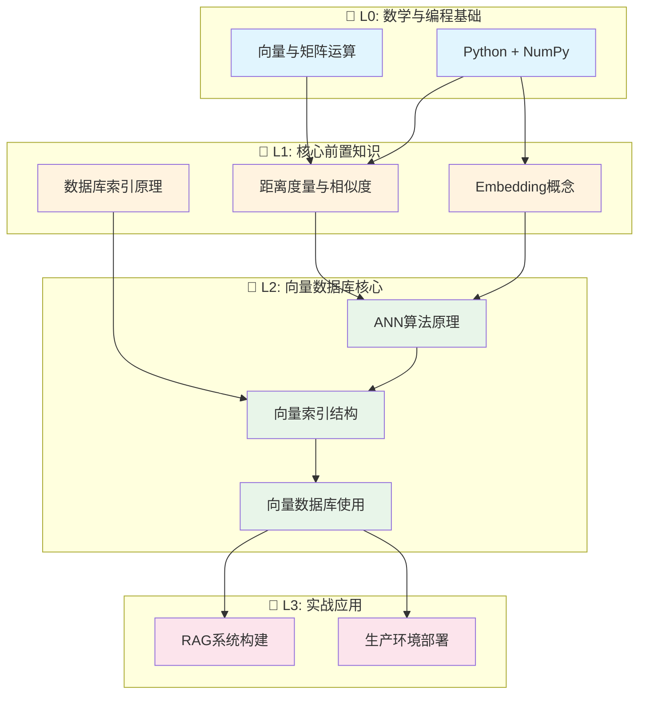

# 向量数据库学习路线图

## 1. 前置知识清单（检查你的地基）

| 层级 | 知识领域 | 核心概念 | 自检问题 |
|------|----------|----------|----------|
| **L0 基础** | 线性代数 | 向量、矩阵、点积 | 你能解释两个向量的余弦相似度吗？ |
| **L0 基础** | Python编程 | 基本语法、NumPy | 你能用NumPy做矩阵运算吗？ |
| **L1 进阶** | 数据库基础 | SQL、索引原理、CRUD | 你理解B+树索引为什么快吗？ |
| **L1 进阶** | 机器学习基础 | Embedding概念 | 你知道词向量是什么吗？ |
| **L2 专项** | 相似度搜索 | KNN、ANN算法 | 你知道暴力搜索的复杂度问题吗？ |

---

## 2. 学习路径依赖图



---

## 3. 每个大类的 20% 核心知识（产生80%效果）

### 📐 L0: 向量与矩阵运算

#### 20% 核心（必须掌握）
| 知识点 | 为什么重要 |
|--------|-----------|
| **向量的定义与表示** | 向量数据库存储的就是向量 |
| **点积运算** | 相似度计算的数学基础 |
| **向量范数(L2)** | 归一化、欧氏距离的基础 |
| **余弦相似度** | 最常用的相似度度量 |

#### 3.1 原子化问题
```
Q1: 什么是向量？一个3维向量[1,2,3]在几何上代表什么？
Q2: 向量[1,0]和[0,1]的点积是多少？这个结果说明什么？
Q3: 向量[3,4]的L2范数是多少？如何计算？
Q4: 两个向量夹角为0°时，余弦相似度是多少？90°呢？
Q5: 为什么文本搜索常用余弦相似度而非欧氏距离？
```

#### 3.2 可跳过的80%
- ❌ 矩阵分解（SVD、PCA细节）——了解概念即可
- ❌ 特征值/特征向量——暂不需要
- ❌ 高等线性代数证明——完全跳过
- ❌ 复数域向量空间——不涉及

---

### 🐍 L0: Python + NumPy

#### 20% 核心
| 知识点 | 为什么重要 |
|--------|-----------|
| **NumPy数组创建与索引** | 向量的基本数据结构 |
| **向量化运算** | 高效计算相似度 |
| **广播机制基础** | 批量向量运算 |

#### 3.1 原子化问题
```
Q1: 如何用NumPy创建一个1000维的随机向量？
Q2: np.dot(a, b) 和 a @ b 有什么区别？
Q3: 如何计算一个向量与矩阵中每一行的点积？（不用循环）
Q4: 如何对一个向量进行L2归一化？
Q5: np.linalg.norm()的默认参数是什么范数？
```

#### 3.2 可跳过的80%
- ❌ NumPy高级索引技巧
- ❌ 结构化数组
- ❌ 内存布局优化（C/Fortran order）
- ❌ 自定义ufunc

---

### 📏 L1: 距离度量与相似度

#### 20% 核心
| 知识点 | 为什么重要 |
|--------|-----------|
| **欧氏距离(L2)** | 最直观的距离度量 |
| **余弦相似度** | 文本/语义搜索首选 |
| **内积(IP)** | 部分模型原生使用 |
| **度量选择原则** | 根据场景选对方法 |

#### 3.1 原子化问题
```
Q1: 欧氏距离和余弦距离在什么情况下等价？
Q2: 为什么推荐系统常用余弦相似度而非欧氏距离？
Q3: 如果向量已归一化，计算余弦相似度可以简化成什么运算？
Q4: OpenAI的text-embedding-ada-002推荐用什么距离度量？
Q5: 内积相似度什么时候会出问题？（提示：向量长度）
```

#### 3.2 可跳过的80%
- ❌ 曼哈顿距离/切比雪夫距离——很少用
- ❌ Jaccard相似度——稀疏场景特有
- ❌ 马氏距离——过于复杂
- ❌ 编辑距离——文本处理用，与向量无关

---

### 🗄️ L1: 数据库索引原理

#### 20% 核心
| 知识点 | 为什么重要 |
|--------|-----------|
| **为什么需要索引** | 理解暴力搜索O(n)的问题 |
| **空间换时间思想** | 所有索引的核心原理 |
| **近似vs精确的权衡** | ANN的核心概念 |

#### 3.1 原子化问题
```
Q1: 1亿条向量，每次暴力搜索需要多少次距离计算？
Q2: 什么是"召回率"？99%召回率意味着什么？
Q3: 为什么向量搜索不能用B+树？
Q4: 预计算和预组织数据有什么区别？
Q5: 什么场景必须用精确搜索而非近似搜索？
```

#### 3.2 可跳过的80%
- ❌ B+树实现细节
- ❌ 哈希索引原理
- ❌ 数据库事务ACID
- ❌ SQL优化器原理

---

### 🎯 L1: Embedding概念

#### 20% 核心
| 知识点 | 为什么重要 |
|--------|-----------|
| **什么是Embedding** | 向量数据库存的就是它 |
| **语义相似性原理** | 为什么相似内容向量接近 |
| **常见Embedding模型** | 知道用什么生成向量 |
| **维度与质量关系** | 选择合适的模型 |

#### 3.1 原子化问题
```
Q1: "国王-男人+女人≈女王"这个例子说明了什么？
Q2: 同一句话用不同模型生成的Embedding能直接比较吗？为什么？
Q3: 768维和1536维的Embedding，哪个一定更好？
Q4: 为什么图片和文本可以映射到同一个向量空间？（CLIP）
Q5: Embedding模型的上下文长度限制会带来什么问题？
```

#### 3.2 可跳过的80%
- ❌ Transformer架构细节
- ❌ 预训练过程
- ❌ 微调技术
- ❌ 注意力机制数学推导

---

### ⚡ L2: ANN算法原理

#### 20% 核心（只需深入掌握HNSW）
| 知识点 | 为什么重要 |
|--------|-----------|
| **HNSW原理** | 90%生产环境的首选 |
| **IVF原理** | 大规模数据的补充方案 |
| **PQ量化概念** | 内存优化的关键 |

#### 3.1 原子化问题
```
Q1: HNSW的"小世界"特性是什么意思？
Q2: HNSW中，M参数增大会带来什么影响？（速度/内存/精度）
Q3: IVF的nlist=100意味着什么？nprobe=10呢？
Q4: 为什么说PQ是"有损压缩"？精度损失有多大？
Q5: 1亿条1536维向量，用HNSW大约需要多少内存？
```

#### 3.2 可跳过的80%
- ❌ LSH算法——已过时
- ❌ Annoy树结构——Spotify特有
- ❌ NSW（非分层版）——只需理解HNSW
- ❌ 各算法的数学证明

---

### 🛠️ L2: 向量数据库使用

#### 20% 核心（以一个数据库为主）
| 知识点 | 为什么重要 |
|--------|-----------|
| **CRUD操作** | 基本使用 |
| **索引参数调优** | 性能优化 |
| **元数据过滤** | 实际业务需求 |
| **批量导入** | 生产必备 |

#### 3.1 原子化问题（以Milvus/Qdrant为例）
```
Q1: 如何创建一个支持1536维向量的Collection？
Q2: 插入100万条向量，应该用什么批量大小？
Q3: 如何在搜索时添加"category='tech'"的过滤条件？
Q4: 索引构建完成前能否搜索？行为是什么？
Q5: 如何评估当前索引参数的召回率？
```

#### 3.2 可跳过的80%
- ❌ 分布式部署架构——后期再学
- ❌ 多租户隔离——特定场景
- ❌ 备份恢复策略——运维层面
- ❌ 所有数据库都学——专精一个即可

---

### 🔥 L3: RAG系统构建

#### 20% 核心
| 知识点 | 为什么重要 |
|--------|-----------|
| **分块策略** | 直接影响检索质量 |
| **Top-K选择** | 平衡上下文与精度 |
| **重排序(Rerank)** | 提升最终效果 |

#### 3.1 原子化问题
```
Q1: 文档分块时，chunk_size=500和overlap=50意味着什么？
Q2: 为什么检索top_k=20然后rerank到top_k=5比直接检索5个效果好？
Q3: 用户问"总结全文"时，向量检索会遇到什么问题？
Q4: 如何评估RAG系统的检索质量？有哪些指标？
Q5: 混合检索(BM25+向量)什么时候有用？
```

#### 3.2 可跳过的80%
- ❌ 复杂的Agent架构
- ❌ 多模态RAG
- ❌ 知识图谱融合
- ❌ 各种Prompt工程技巧

---

## 📋 学习行动清单

```
Week 1: L0 数学基础 + Python/NumPy
        → 完成所有原子化问题
      
Week 2: L1 距离度量 + Embedding概念
        → 用OpenAI API生成向量并手动计算相似度
      
Week 3: L2 HNSW原理 + 选择一个数据库实操
        → 推荐: Qdrant(易上手) 或 Milvus(功能全)
      
Week 4: L3 构建一个简单RAG应用
        → 文档问答系统
```

需要我展开任何一个部分的详细学习材料吗？