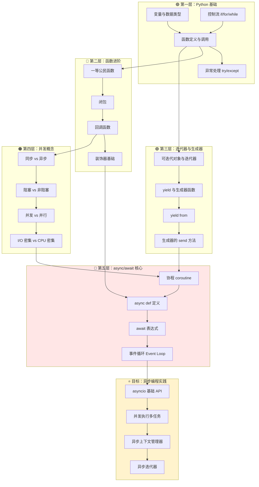

# Python 异步编程（async/await）学习路径

## 1. 前置知识清单（检查你的地基）

```
✅ 必须掌握          ⚠️ 需要了解           📌 有帮助但非必需
─────────────────────────────────────────────────────────────
□ Python 基础语法    □ 回调函数概念         □ 网络编程基础
□ 函数定义与调用     □ 同步/异步概念        □ 多线程经验
□ 迭代器基础        □ 阻塞/非阻塞 I/O      □ 事件驱动编程
□ 生成器(yield)     □ 上下文管理器         □ 操作系统调度
□ 异常处理          □ 装饰器基础
```

---

## 2. 学习路径依赖图



---

## 3. 每个大类的 20% 核心知识

### 📊 核心知识总览

| 层级 | 20% 核心（必学） | 80% 枝节（可跳过） |
|------|------------------|-------------------|
| 函数进阶 | 回调函数、闭包概念 | 装饰器高级用法、functools 全家桶 |
| 生成器 | yield 基础、send() | yield from 复杂委托、生成器表达式优化 |
| 并发概念 | 同步/异步区别、I/O 密集理解 | 操作系统调度细节、epoll/kqueue 原理 |
| async/await | async def、await、asyncio.run | 底层协程实现、自定义事件循环 |

---

## 3.1 原子化问题清单

### 🔵 第二层：函数进阶（核心 20%）

```python
# ===== 回调函数 =====
```

**Q1: 什么是回调函数？**
```python
# 能否解释这段代码中哪个是回调函数？
def process_data(data, callback):
    result = data * 2
    callback(result)

def print_result(x):
    print(f"结果是: {x}")

process_data(5, print_result)
```
<details><summary>答案</summary>
`print_result` 是回调函数。它作为参数传递给 `process_data`，在数据处理完成后被"回调"执行。
</details>

---

**Q2: 为什么异步编程需要回调？**
```python
# 同步方式
result = download_file(url)  # 阻塞等待
process(result)

# 异步回调方式
download_file_async(url, callback=process)  # 不阻塞，完成后自动调用 process
```
<details><summary>答案</summary>
因为异步操作不会立即返回结果，需要一种机制在"将来某个时刻"处理结果，回调就是这种机制。
</details>

---

**Q3: 闭包是什么？能捕获什么？**
```python
def make_counter():
    count = 0
    def counter():
        nonlocal count
        count += 1
        return count
    return counter

c = make_counter()
print(c())  # 输出什么？
print(c())  # 输出什么？
```
<details><summary>答案</summary>
输出 1，然后 2。闭包捕获了外层函数的变量 `count`，并且这个变量在多次调用间保持状态。
</details>

---

### 🟣 第三层：生成器（核心 20%）

**Q4: yield 和 return 的本质区别是什么？**
```python
def normal_func():
    return 1
    return 2  # 永远不会执行

def generator_func():
    yield 1
    yield 2  # 会执行！

# 调用方式有什么不同？
```
<details><summary>答案</summary>
`return` 终止函数并返回值；`yield` 暂停函数并产出值，下次调用从暂停处继续。生成器函数调用返回的是生成器对象，需要迭代才能获取值。
</details>

---

**Q5: 生成器的 send() 方法有什么用？**
```python
def echo():
    while True:
        received = yield
        print(f"收到: {received}")

g = echo()
next(g)        # 启动生成器，执行到第一个 yield
g.send("hello")  # 输出什么？
g.send("world")  # 输出什么？
```
<details><summary>答案</summary>
输出 "收到: hello" 和 "收到: world"。`send()` 可以向生成器内部传值，这是协程双向通信的基础。
</details>

---

**Q6: 这段代码的执行顺序是什么？**
```python
def gen():
    print("A")
    x = yield 1
    print("B", x)
    y = yield 2
    print("C", y)

g = gen()
print(next(g))
print(g.send(10))
```
<details><summary>答案</summary>
顺序：打印 A → 返回 1 → 打印 B 10 → 返回 2。每次 yield 都是一个暂停点。
</details>

---

### 🟠 第四层：并发概念（核心 20%）

**Q7: 用生活例子解释同步 vs 异步**
```
场景：你在咖啡店点了咖啡

同步方式：_____________
异步方式：_____________
```
<details><summary>答案</summary>
同步：站在柜台前等咖啡做好，期间什么都不做。
异步：拿个号码牌，去找位子坐/刷手机，咖啡好了叫你。
</details>

---

**Q8: 为什么 Python 异步适合 I/O 密集型任务？**
```python
# 场景：同时下载 100 个网页

# 方案 A：同步循环
for url in urls:
    download(url)  # 每个等待 1 秒

# 方案 B：异步并发
await asyncio.gather(*[download_async(url) for url in urls])

# 哪个更快？为什么？
```
<details><summary>答案</summary>
方案 B 更快。I/O 操作（网络请求）大部分时间在等待，不占用 CPU。异步可以在等待时切换执行其他任务，100 个请求几乎同时发出。
</details>

---

**Q9: 阻塞和非阻塞的区别是什么？**
```python
# 阻塞
data = socket.recv(1024)  # 没数据来就一直卡住

# 非阻塞
socket.setblocking(False)
data = socket.recv(1024)  # 没数据来会怎样？
```
<details><summary>答案</summary>
非阻塞模式下，没数据会立即抛出异常（或返回空），不会卡住。程序可以去做其他事，稍后再检查。
</details>

---

### 🔴 第五层：async/await 核心（核心 20%）

**Q10: 协程函数和普通函数的调用区别？**
```python
async def fetch_data():
    return "data"

def normal_func():
    return "data"

result1 = normal_func()   # result1 是什么？
result2 = fetch_data()    # result2 是什么？
```
<details><summary>答案</summary>
`result1` 是字符串 "data"；`result2` 是一个协程对象（coroutine object），不是实际结果！需要 `await` 或 `asyncio.run()` 才能获取结果。
</details>

---

**Q11: await 只能在哪里使用？**
```python
async def outer():
    result = await inner()  # ✅ 
    return result

def regular():
    result = await inner()  # ❌ 为什么错？
    return result
```
<details><summary>答案</summary>
`await` 只能在 `async def` 定义的协程函数内部使用。在普通函数中使用会报 SyntaxError。
</details>

---

**Q12: 这段代码的输出顺序是什么？**
```python
import asyncio

async def task1():
    print("1-start")
    await asyncio.sleep(2)
    print("1-end")

async def task2():
    print("2-start")
    await asyncio.sleep(1)
    print("2-end")

async def main():
    await asyncio.gather(task1(), task2())

asyncio.run(main())
```
<details><summary>答案</summary>
顺序：1-start → 2-start → 2-end → 1-end。
两个任务并发执行，task2 等待时间短先完成。
</details>

---

**Q13: asyncio.run() 做了什么？**
```python
import asyncio

async def main():
    return "hello"

# 方式 1
result = asyncio.run(main())

# 方式 2（错误）
result = main()

# 为什么需要 asyncio.run()？
```
<details><summary>答案</summary>
`asyncio.run()` 创建事件循环 → 运行协程直到完成 → 关闭事件循环。这是异步程序的入口点，相当于"启动异步引擎"。
</details>

---

**Q14: 以下代码是并发还是顺序执行？**
```python
async def main():
    # 方式 A
    result1 = await fetch(url1)
    result2 = await fetch(url2)
  
    # 方式 B
    result1, result2 = await asyncio.gather(
        fetch(url1), 
        fetch(url2)
    )
```
<details><summary>答案</summary>
方式 A 是顺序执行（等 url1 完成才开始 url2）；方式 B 是并发执行（同时开始两个请求）。
</details>

---

**Q15: 事件循环是什么？用一句话解释**
<details><summary>答案</summary>
事件循环是一个无限循环，不断检查"哪些协程可以继续执行了"，然后切换到那个协程。它是异步程序的调度中心/交通指挥官。
</details>

---

## 3.2 可跳过的 80% 枝节

### 🚫 初学阶段可跳过的内容

```
┌─────────────────────────────────────────────────────────────────┐
│  📁 函数进阶                                                     │
│  ├── ❌ functools.wraps 的实现细节                              │
│  ├── ❌ 装饰器工厂、带参数装饰器                                  │
│  ├── ❌ 描述符协议 __get__/__set__                              │
│  └── ❌ 元类与装饰器的结合                                       │
├─────────────────────────────────────────────────────────────────┤
│  📁 生成器                                                       │
│  ├── ❌ yield from 的完整语义（异常传播、返回值）                 │
│  ├── ❌ 生成器的 throw() 和 close() 方法                        │
│  ├── ❌ 生成器表达式的内存优化细节                                │
│  └── ❌ PEP 342/380 的历史背景                                   │
├─────────────────────────────────────────────────────────────────┤
│  📁 并发概念                                                     │
│  ├── ❌ select/poll/epoll/kqueue 底层实现                       │
│  ├── ❌ 操作系统线程调度算法                                      │
│  ├── ❌ GIL 的实现细节                                          │
│  └── ❌ 信号量、互斥锁的底层原理                                  │
├─────────────────────────────────────────────────────────────────┤
│  📁 async/await                                                  │
│  ├── ❌ 自定义事件循环                                           │
│  ├── ❌ asyncio.Protocol 和 Transport                           │
│  ├── ❌ 协程的 __await__ 协议实现                                │
│  ├── ❌ uvloop 等第三方事件循环                                  │
│  ├── ❌ contextvars 上下文变量                                   │
│  └── ❌ asyncio 源码实现                                         │
└─────────────────────────────────────────────────────────────────┘
```

---

## 📝 学习建议

```
学习顺序建议：
━━━━━━━━━━━━━━━━━━━━━━━━━━━━━━━━━━━━━━━━━━━━━

Week 1  │ 回顾生成器 yield、理解 send()
        │ 动手练习：写一个简单的协程模拟器
        ↓
Week 2  │ 理解同步/异步、阻塞/非阻塞概念
        │ 不写代码，画图理解
        ↓
Week 3  │ async def + await + asyncio.run()
        │ 动手练习：并发下载多个网页
        ↓
Week 4  │ asyncio.gather、create_task
        │ 实战项目：异步爬虫或异步 API 客户端

━━━━━━━━━━━━━━━━━━━━━━━━━━━━━━━━━━━━━━━━━━━━━
```

---

需要我针对某个具体知识点展开详细讲解吗？