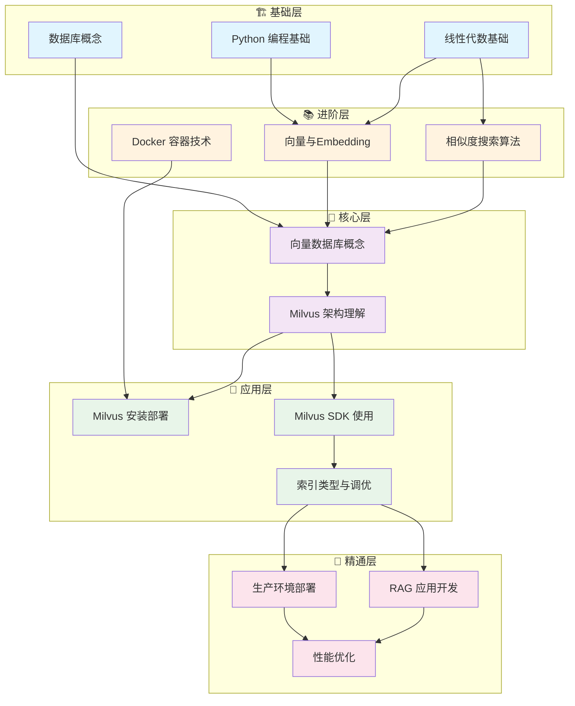

# Milvus 学习路径指南

## 1. 前置知识清单（地基检查）

### 核心前置知识
| 类别 | 知识点 | 重要程度 |
|------|--------|----------|
| **编程语言** | Python 基础 | ⭐⭐⭐⭐⭐ |
| **数据库基础** | SQL 概念、CRUD 操作 | ⭐⭐⭐⭐ |
| **数学基础** | 线性代数（向量、矩阵） | ⭐⭐⭐⭐⭐ |
| **机器学习** | Embedding 概念、相似度计算 | ⭐⭐⭐⭐⭐ |
| **分布式系统** | 基本概念（可选但有帮助） | ⭐⭐⭐ |
| **Docker** | 容器基础操作 | ⭐⭐⭐⭐ |

---

## 2. 学习路径依赖图



---

## 3. 每个大类的 20/80 法则

### 3.1 各模块核心知识点 + 原子化问题

---

### 📘 模块一：Python 编程基础

#### 20% 核心内容
```
✅ 数据结构：list, dict, numpy array
✅ 函数与类的基本使用
✅ 包管理与虚拟环境（pip, venv）
✅ 异步编程基础（async/await）
```

#### 原子化问题清单
| # | 问题 | 验证标准 |
|---|------|----------|
| 1 | 如何创建一个 numpy 数组并获取其 shape？ | 能写出 `np.array()` 和 `.shape` |
| 2 | `list` 和 `numpy array` 在向量计算上的区别是什么？ | 能解释广播机制和性能差异 |
| 3 | 如何用 pip 安装指定版本的包？ | 能写出 `pip install pkg==1.0` |
| 4 | Python 的 `async/await` 解决什么问题？ | 能解释 IO 密集型场景 |
| 5 | 如何将 dict 转换为 JSON 字符串？ | 能使用 `json.dumps()` |

#### 80% 可跳过的枝节
```
❌ 元类编程、装饰器高级用法
❌ GIL 深入原理
❌ Python C 扩展
❌ 多线程/多进程细节（初期）
```

---

### 📘 模块二：线性代数基础

#### 20% 核心内容
```
✅ 向量的定义与表示
✅ 向量的维度概念
✅ 向量的加法、点积运算
✅ 向量的范数（L2 norm）
```

#### 原子化问题清单
| # | 问题 | 验证标准 |
|---|------|----------|
| 1 | 什么是 N 维向量？举例说明 | 能解释 [1,2,3] 是 3 维向量 |
| 2 | 两个向量的点积如何计算？ | 能手算 [1,2]·[3,4]=11 |
| 3 | 向量的 L2 范数是什么？有什么用？ | 能解释是长度，用于归一化 |
| 4 | 为什么高维向量可以表示语义？ | 能解释 embedding 空间概念 |
| 5 | 余弦相似度的公式是什么？ | 能写出 cos(θ) = A·B / (|A||B|) |

#### 80% 可跳过的枝节
```
❌ 矩阵分解（SVD、PCA 推导）
❌ 特征值/特征向量证明
❌ 张量运算的数学细节
❌ 线性变换的几何意义深入
```

---

### 📘 模块三：Embedding 与相似度搜索

#### 20% 核心内容
```
✅ Embedding 是什么：将离散对象映射为稠密向量
✅ 常见 Embedding 模型：OpenAI、Sentence-Transformers
✅ 相似度度量：余弦相似度、欧氏距离、内积
✅ ANN vs KNN 的概念
```

#### 原子化问题清单
| # | 问题 | 验证标准 |
|---|------|----------|
| 1 | 文本 Embedding 的作用是什么？ | 能解释"语义相似的文本，向量距离近" |
| 2 | 余弦相似度和欧氏距离的适用场景分别是？ | 能说出归一化向量用余弦 |
| 3 | 为什么不直接用 KNN 做大规模搜索？ | 能解释时间复杂度 O(n) 问题 |
| 4 | ANN 算法牺牲了什么换取速度？ | 能回答"准确率" |
| 5 | 如何用 Python 调用一个 Embedding 模型？ | 能写出 sentence-transformers 示例 |

#### 80% 可跳过的枝节
```
❌ Word2Vec/GloVe 训练细节
❌ Transformer 注意力机制数学推导
❌ 各种 ANN 算法（HNSW、IVF）的实现细节
❌ Embedding 模型微调
```

---

### 📘 模块四：Docker 基础

#### 20% 核心内容
```
✅ Docker 是什么：轻量级容器
✅ 基本命令：pull, run, ps, stop, rm
✅ 端口映射与数据卷
✅ docker-compose 基础用法
```

#### 原子化问题清单
| # | 问题 | 验证标准 |
|---|------|----------|
| 1 | 如何拉取并运行一个 Docker 镜像？ | 能写出 `docker run` |
| 2 | `-p 19530:19530` 是什么意思？ | 能解释端口映射 |
| 3 | 数据卷（-v）解决什么问题？ | 能说出数据持久化 |
| 4 | docker-compose up -d 做了什么？ | 能解释后台启动多容器 |
| 5 | 如何查看正在运行的容器？ | 能使用 `docker ps` |

#### 80% 可跳过的枝节
```
❌ Dockerfile 高级编写
❌ 多阶段构建
❌ Docker 网络模式细节
❌ Kubernetes 编排（初期）
```

---

### 📘 模块五：Milvus 核心概念

#### 20% 核心内容
```
✅ Milvus 是什么：专为向量设计的数据库
✅ 核心概念：Collection, Partition, Index, Segment
✅ 数据模型：向量字段 + 标量字段
✅ 索引类型：IVF_FLAT, HNSW（知道选哪个）
```

#### 原子化问题清单
| # | 问题 | 验证标准 |
|---|------|----------|
| 1 | Milvus 和传统数据库的核心区别是什么？ | 能说出"为向量搜索优化" |
| 2 | Collection 和 Partition 的关系是什么？ | 能类比为表和分区 |
| 3 | 为什么需要创建索引？不创建会怎样？ | 能解释暴力搜索 vs ANN |
| 4 | IVF_FLAT 和 HNSW 该怎么选？ | 能说出场景差异 |
| 5 | Milvus 支持哪些相似度度量？ | 能列出 L2, IP, COSINE |

#### 80% 可跳过的枝节
```
❌ Milvus 内部存储引擎实现
❌ 分布式一致性协议
❌ Segment 合并策略
❌ 索引算法的数学推导
```

---

### 📘 模块六：Milvus 实战操作

#### 20% 核心内容
```
✅ 安装：docker-compose 一键部署
✅ 连接：pymilvus 客户端
✅ CRUD：create_collection, insert, search, delete
✅ 混合查询：向量搜索 + 标量过滤
```

#### 原子化问题清单
| # | 问题 | 验证标准 |
|---|------|----------|
| 1 | 如何用 docker-compose 启动 Milvus？ | 能执行官方 yaml |
| 2 | 如何用 pymilvus 连接到 Milvus？ | 能写出 connections.connect() |
| 3 | 创建 Collection 需要定义什么？ | 能说出 schema（字段定义） |
| 4 | search() 方法的核心参数有哪些？ | 能说出 data, anns_field, limit |
| 5 | 如何实现"搜索相似向量且 price < 100"？ | 能使用 expr 参数 |

#### 80% 可跳过的枝节
```
❌ gRPC 协议细节
❌ 手动管理 Segment
❌ 高级 Partition 策略
❌ 自定义 Metric Type
```

---

### 📘 模块七：RAG 应用开发

#### 20% 核心内容
```
✅ RAG 是什么：检索增强生成
✅ 基本流程：Query → Embedding → Search → LLM
✅ 文档切分策略：chunk size, overlap
✅ 与 LangChain/LlamaIndex 集成
```

#### 原子化问题清单
| # | 问题 | 验证标准 |
|---|------|----------|
| 1 | RAG 解决 LLM 的什么问题？ | 能说出"知识截止/幻觉" |
| 2 | RAG 的基本流程是什么？ | 能画出 4 步流程 |
| 3 | 文档 chunk_size 设多大合适？ | 能说出 500-1000 tokens 范围 |
| 4 | overlap 的作用是什么？ | 能解释上下文连续性 |
| 5 | 如何用 LangChain 集成 Milvus？ | 能写出基本代码 |

#### 80% 可跳过的枝节
```
❌ 高级 RAG（HyDE、Re-rank）
❌ 多轮对话记忆管理
❌ Fine-tune Embedding 模型
❌ 复杂 Agent 架构
```

---

## 📊 学习路径总结图

```mermaid
gantt
    title Milvus 学习路线（预估时间）
    dateFormat  X
    axisFormat %s天
  
    section 基础层
    Python 基础复习     :a1, 0, 3
    线性代数核心       :a2, 0, 2
  
    section 进阶层
    Embedding 概念     :b1, after a1, 2
    Docker 基础        :b2, after a1, 1
  
    section 核心层
    Milvus 概念        :c1, after b1, 2
    Milvus 实战        :c2, after c1, 3
  
    section 应用层
    RAG 应用开发       :d1, after c2, 4
```



---

## 🎯 快速开始检查清单

在开始学习 Milvus 之前，确认你能回答：

```
□ 能用 Python 操作 numpy 数组
□ 理解向量、维度、距离的概念
□ 知道什么是 Embedding
□ 能运行 docker-compose up
```

如果以上都能做到，可以直接从**模块五（Milvus 核心概念）**开始！